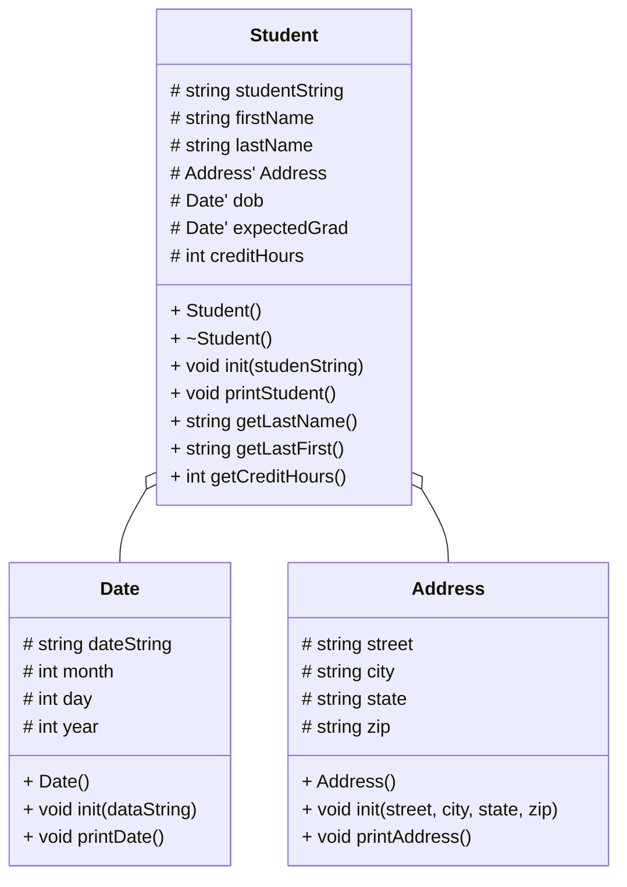

# Heap of Students Documentation

## UML diagram

## loadStudents
open students.csv file
while there are lines to read:
    read one line
    create a new Student on the heap
    call init(line) on that Student
    append pointer to vector
close file

## printStudents
for each student in vector:
    student->printStudent()
    print a divider for between students

## showStudentNames
for each student in vector:
    print student->getFirstLast()
    
## findStudents
prompt user for last name search term
for each student in vector:
    if student's last name contains search term:
        student->printStudent()
        print divider
    else if no matches found:
        print no matches found

## delStudents
for each student in vector:
    delete student
clear the vector

## menu()
print 0) quit
print 1) print all student names
print 2) print all student data
print 3) find a student
prompt the user for what they want to do
return choice string
        ask the user for the last name of the student they are searching for
        go through the student vector and find students that last name are either the input or contain the input
