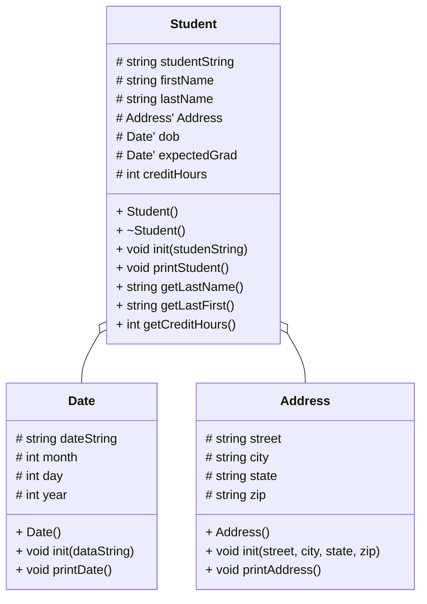

# Heap of Students Documentation

## UML diagram

## loadStudents
Use ifstream to open the file
if the file opened properly
    while not at the end of the file
        Create a Student instance on the heap by initializing it with the string from the file
        Append the instance to a vector
    close the file

## printStudents

## showStudents
Open the file
if the file opened properly
    while not at the end of the file
        print out last names and first names of all the students
    close the file
    
## findStudents

## delStudents

## menu()
While the user wants to keep going
    Print out a menu that presents the user with choices of what they want to do
    Ask the user for what they want to do
    if the user inputs 0
        they don't want to keep going terminate the loop
    elif the user inputs 1
        calls showStudents so only first and last name are printed
    elif the user inputs 2
        calls printStudents so all the student data is printed
    else
        ask the user for the last name of the student they are searching for
        go through the student vector and find students that last name are either the input or contain the input
